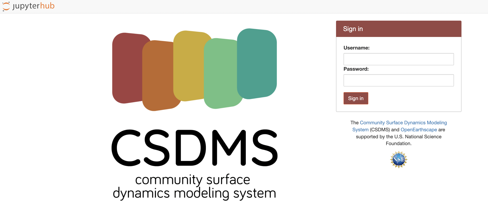

# CSDMS Products Demo
[](https://github.com/gantian127/overlandflow_usecase/blob/master/LICENSE.txt)

This repository includes a Jupyter Notebook for a clinic on CSDMS products and services at the [CSDMS 2023 Annual Meeting](https://csdms.colorado.edu/wiki/Form:Annualmeeting2023). 
This notebook demonstrates how to utilize the [Landlab](https://landlab.readthedocs.io/en/master/) and [Data Components](https://csdms.colorado.edu/wiki/DataComponents) 
for Earth Surface Processes modeling. You can run this notebook either on the CSDMS JupyterHub or on the local PC.

### Method 1: Use the CSDMS JupyterHub
- All the annual meeting participants have a user account on the CSDMS JupyterHub.
- Click on **[this link](https://lab.openearthscape.org/hub/user-redirect/git-pull?repo=https%3A%2F%2Fgithub.com%2F%2Fgantian127%2Fcsdms_workshop&urlpath=lab%2Ftree%2Fcsdms_workshop%3Fautodecode&branch=master)**.
It will lead you to the login page (see figure below). After you provide the account info, the tutorial notebooks will be loaded on the CSDMS JupyterHub.
- Select the **"CSDMS" kernel** before running the notebooks.



### Method 2: Use Local PC
- Clone the workshop repository to the local PC.
```
$ git clone https://github.com/gantian127/csdms_workshop
$ cd csdms_workshop
```

- Create and activate a virtual environment named as "landlab_tutorials".
The environment.yml file is in the "csdms_workshop" folder.
```
$ conda env create --file=environment.yml
$ conda activate csdms_clinic
```

- Launch the Jupyter Notebook on the local PC.
```
$ jupyter notebook
```
